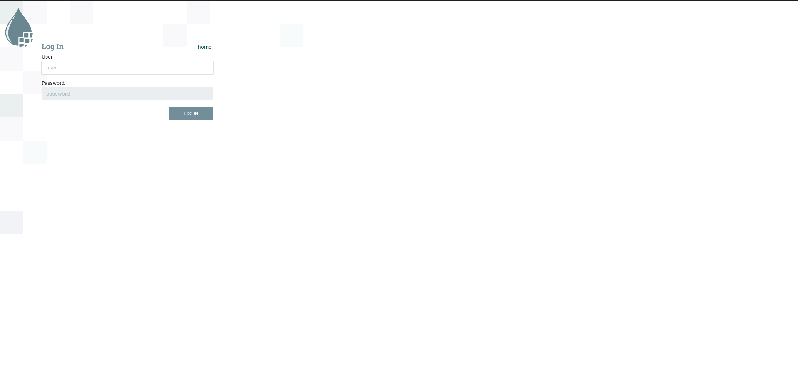
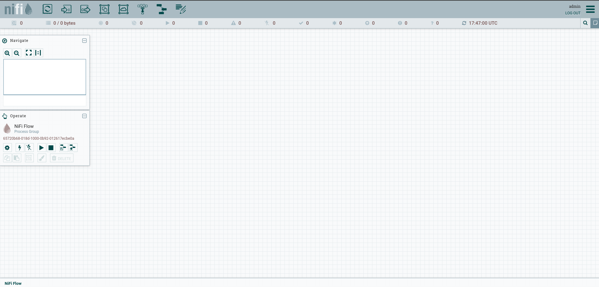
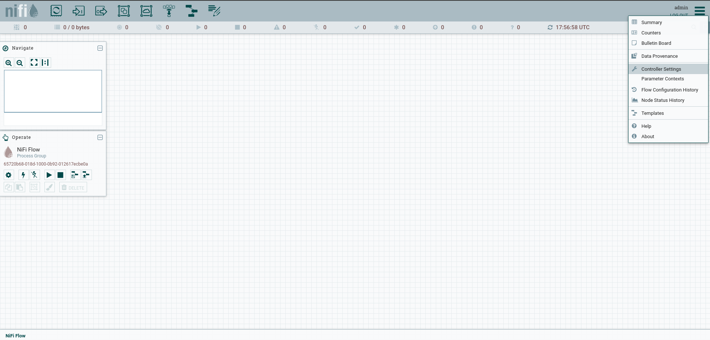
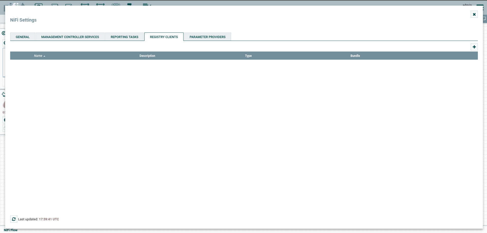
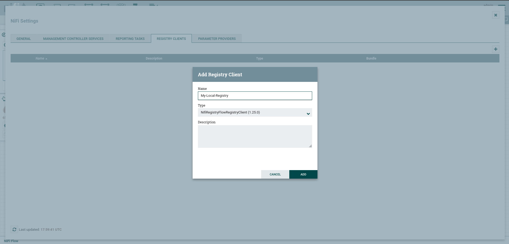
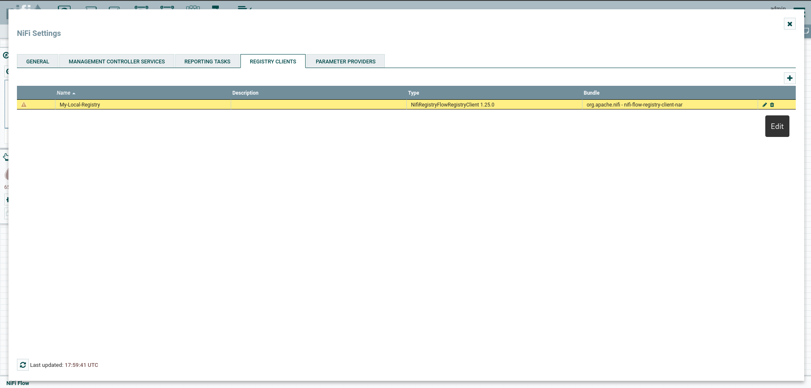
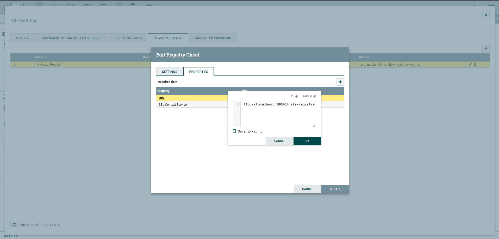

# Apache NiFi installation with Docker

To create and run a NiFi container with docker you will need to have [Docker](https://www.docker.com/)
and [docker-compose](https://docs.docker.com/compose/compose-file/) installed in your local machine. Once 
you have installed you can continue with the running process

## Running NiFi with Docker
To run NiFi with docker we will need to run two containers, the [apache/nifi](https://hub.docker.com/r/apache/nifi) 
and the [apache/nifi-registry](https://hub.docker.com/r/apache/nifi-registry) containers. To run the 
**apache/nifi** container you can download the nifi.yaml file and run the next command:

```shell
docker-compose -f nifi.yaml up -d
```

This will create and run a container with the 1.25.0 NiFi version in the port 8443, with: 
* username = admin 
* password = 089ba19573e54850a3d3d50493cc1e9d
* container_name = NiFi-1.25.0

If you want to change these settings you can do it by replacing the environment values in the 
nifi.yaml file.

Make sure that your container is running properly in this port. To verify any issue you can check 
the logs of the container with the next command:

```shell
docker logs -f NiFi-1.25.0
```

**After that**, you will need to run the **apache/nifi-registry** container. To do so, you need 
to download the nifi-registry.yaml file and run the next command:

```shell
docker-compose -f nifi-registry.yaml up -d
```

This will create and run a container with the 1.25.0 nify-registry version in the port 18080, with: 
* container_name = NiFi-registry-1.25.0

## Login with username and password

Once you have both of these containers running you need to go to [this url](https://localhost:8443/nifi/) 
and accept the advanced settings to navigate to this webpage. **Please note that this url is redirecting 
to your local machine IP and therefor is secure to proceed with this connection**. Once you have entered 
to the url mentioned before you will see the NiFi webpage in your browser:



Please enter the credentials of your nifi.yaml file and then you will see the NiFi application page:



### You have not finished yet

Once you have logged in, you need to add the nify-registry to the NiFi application. To do so, you need to 
click in the top-right sandwich menu and select *Controller settings*:



And go to the *Registry clients* tab:



Here you can add any registry client that you want. Let's add the nifi-registry we have running in port 
number 18080. To add it you need to click in the plus (+) button and you will see a pop-up menu to add 
a registry client:



Put any name that you like and click on the "add" button. Once you have added you can configure it with 
the pencil button of the registry client you have created



In the pop-up menu that is showed to you, you need to go to the *properties* tab and click in the URL 
value to edit that registry. Here a dialog menu will show up and you can place the [url](http://localhost:18080/nifi-registry) 
to the nifi-registry container. Then click in "ok" button to save it



Now with this, you can start run your flows in NiFi